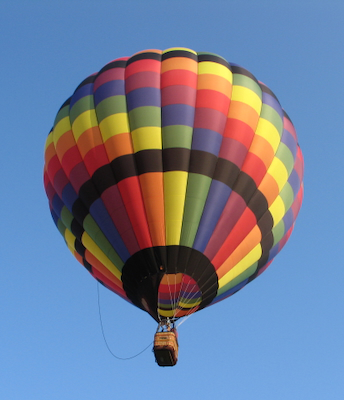

# Hi there – I'm Aaron 👋

<!--
**awolske1/awolske1** is a ✨ _special_ ✨ repository because its `README.md` (this file) appears on your GitHub profile.

Here are some ideas to get you started:-->
## A little about me

The shortest version I can give here is I've been an art director for the last 20 years. I'm coming back to finish a degree that I stop/started a couple times. I've got a ton of experience with the print side of the industry, but not much web/digital other than a few banners, social animation videos, and a handful of landing pages. I would not consider myself technically/analytically inclined, but I love to work on data-driven strategy informed advertising.

I've got some bullet points about me as well listed below. 

<h4> 
    <a href="http://aaronwolske.carbonmade.com" target="_blank"><u>My Portfolio Website</u></a> 
    <a href="https://www.linkedin.com/in/aaron-wolske" target="_blank"><u>My LinkedIn Page</u></a>
</h4>

    🔭 I’m currently working on ... Getting my degree after waaaaaay too long  
    🌱 I’m currently learning ... HTML and CSS coding, and I'm also in REL100 to finish up my HUAD requirements 
    👨🏻‍💻 I've committed and pushed ... the code for this README soooo many times 
    📫 How to reach me ... IYKYK, otherwise, it's my profile name to the asu.edu 
    😄 Pronouns ... He/Him/His/Y'all 
    🎈 Fun fact ... I have a private license to fly hot air balloons. The weather where I live has been affected by climate change, and there are very few days to safely fly now, so I sold my balloon. But here's a photo of it.  
 
This was my hot air balloon. It was named Guaranteed High.

